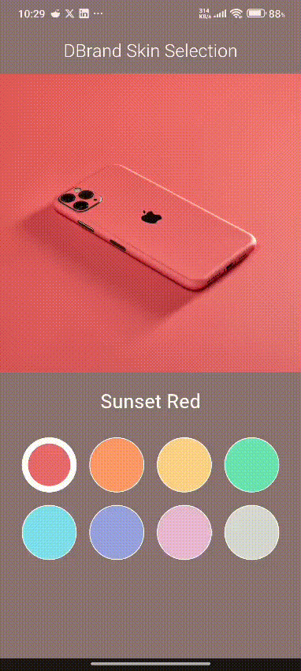
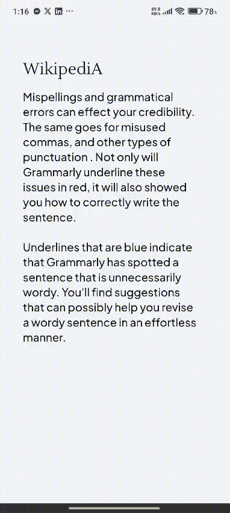

# 🎨 Practise Pro

> A Flutter playground showcasing various UI implementations, animations, and design patterns.


---

## ✨ Features

| # | Feature | Concepts Demonstrated |
|:-:|---------|----------------------|
| 1 | [DBrand Skin Selection](#-dbrand-skin-selection) | Custom Clipper, Animations, Color Blending |
| 2 | [Grammarly Writing Assistant](#-grammarly-writing-assistant) | State Management, Text Selection, Modal Bottom Sheet |


---

## 📱 Implementations

### 🎭 DBrand Skin Selection

<p align="center">
  
</p>

**Inspired by:** [DBrand](https://dbrand.com) skin customization interface

**Techniques demonstrated:**
- ✅ `AnimationController` with `SingleTickerProviderStateMixin`
- ✅ Custom `CustomClipper<Path>` for circular reveal transitions
- ✅ Randomized animation origins (9 alignment positions)
- ✅ `AnimatedContainer` for smooth selection states
- ✅ `Color.alphaBlend` for dynamic background colors
- ✅ Dart 3 pattern matching with `switch` expressions
- ✅ Extension methods for `Alignment.toOffset()`

---

### ✨ Grammarly Writing Assistant

<p align="center">
  
</p>

**Inspired by:** [Grammarly](https://www.grammarly.com/) AI writing assistant UI

**Techniques demonstrated:**
- ✅ `Hooks Riverpod` with code generation for reactive state management
- ✅ Text selection detection on `TextField` using `selection` property
- ✅ Modal bottom sheet with drag handle and customizable height
- ✅ Custom toast notifications with slide-up and fade animations
- ✅ `Material ChoiceChip` for predefined action options
- ✅ `flutter_animate` for smooth entrance/exit animations
- ✅ Responsive design using `flutter_screenutil`
- ✅ SVG icon integration with `flutter_svg`
- ✅ Figma design implementation with pixel-perfect accuracy
- ✅ Custom text field decoration with selection highlighting
- ✅ Multi-layer architecture: Presentation, Domain, Application, Core layers

---

## 🛠️ Tech Stack

| Category | Technology |
|----------|------------|
| **Framework** | Flutter 3.x |
| **Language** | Dart 3.x |
| **State Management** | SetState (vanilla), Hooks Riverpod |

---

## 📁 Project Structure

```
lib/
├── main.dart                              # App entry & navigation hub
├── dbrand_skin_selection/                 # Feature module
│   ├── dbrand_skin.dart                   # Data model
│   └── dbrand_skin_selection.dart         # UI implementation
└── grammarly_recreate/                    # Feature module (Clean Architecture)
    ├── application/                       # State management (Riverpod)
    │   └── text_assistant_provider.dart   # Text selection state notifier
    ├── domain/                            # Business logic
    │   └── text_action.dart               # Domain models
    ├── core/                              # Shared utilities
    │   └── theme/                         # App colors & typography
    └── presentation/                      # UI layer
        ├── home_page.dart                 # Main page with text editor
        └── widgets/                       # Reusable UI components
            ├── custom_toast.dart
            ├── writing_assistant_bottom_sheet.dart
            ├── action_chip.dart
            └── text_action_button.dart

assets/
├── dbrand_skin_selection/                 # Feature assets
│   ├── icons/
│   └── images/                            # Skin images
├── grammarly_recreate/                    # Feature assets
│   ├── icons/                             # SVG icons
│   └── images/                            # UI images
└── screenshots/                           # Demo GIFs & images
```

---

## 🚀 Getting Started

```bash
# Clone the repository
git clone https://github.com/Eleaus-Hossain-Evan/practise_pro.git

# Navigate to project
cd practise_pro

# Install dependencies
flutter pub get

# Run the app
flutter run
```

---

## 📝 License

This project is open source and available under the [MIT License](LICENSE).

---

## 👤 Author

**Eleaus Hossain Evan**

[](https://github.com/Eleaus-Hossain-Evan)
[](https://www.linkedin.com/in/eleaus-hossain-evan-2b21ab160/)
[](https://x.com/Eevan96)
[](https://www.facebook.com/evan.hossain.549)

---

<p align="center">
  Made with ❤️ and Flutter
</p>
